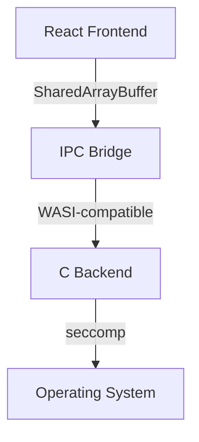

# Reavix Quick Start Guide

## Prerequisites

- Node.js 18+
- Zig 0.11.0 (for cross-compilation)
- Clang 15+ (recommended)

## Demo

```bash
npx create-reavix@latest my-app --template=file-explorer
cd my-app
npm run dev
```

### Basic

```typescript
import reavix from "reavix";

async function listFiles() {
  //Calls C backend via shared memory IPC
  const files = await reavix.fs.readDir("/");
  console.log(files);
}
```

### Architecture Overview



### Performance Characteristics

- IPC latency: <100ns (shared memory)
- JSON parsing: SIMD-accelerated, ~2GB/s
- Memory overhead: <10MB (vs Electron's 100Mb+)
